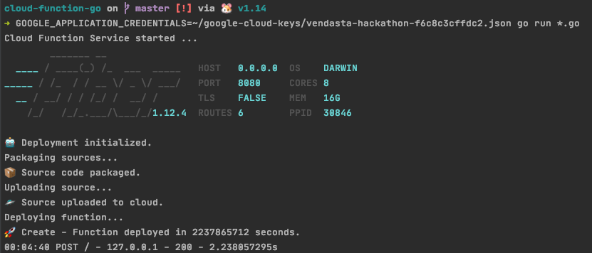
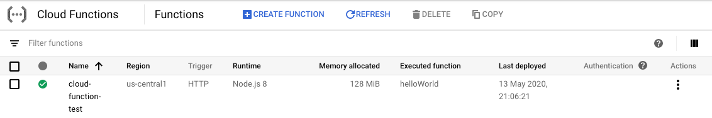

# API in GO to create Cloud Function

> An API for deploying and calling Google Cloud Functions in Go.

## Create a private key to access the GCP

For this method, you'll need to [create a service account](https://cloud.google.com/docs/authentication/getting-started), and download a key.

1. In the GCP Console, go to the [Create service account key](https://console.cloud.google.com/apis/credentials/serviceaccountkey?_ga=2.44822625.-475179053.1491320180) page.
2. From the Service account drop-down list, select New service account.
3. In the Service account name field, enter a name.
4. From the Role drop-down list, select Project > Owner.
5. Click Create. A JSON file that contains your key downloads to your computer.
6. Copy the key in this folder and change the constant `JSONKeyPath` at `main.go`;
7. Update the constant `projectID` with the name of your project at `main.go`;

## Run

```bash
go run *.go
```

Send the below request to http://localhost:3000/:

### Request

```json
{
	"name": "cloud-function-test",
	"files": [{
		"name": "index.js",
		"content": "exports.helloWorld = (req, res) => {\n  let message = req.query.message || req.body.message || 'Hello World! 4';\n  res.status(200).send(message);\n};"
	}, {
		"name": "package.json",
		"content": "{\n  \"name\": \"sample-http\",\n  \"version\": \"0.0.1\"\n}"
	}]
}
```

### Result






## Libraries

- https://github.com/gofiber/fiber

## References

- Cloud Function API: https://cloud.google.com/functions/docs/reference/rest
- Client Libraries: https://cloud.google.com/apis/docs/client-libraries-explained
- An API and CLI for deploying Google Cloud Functions in Node.js: https://github.com/JustinBeckwith/gcx
- Deploying from the Google Cloud Functions API: https://cloud.google.com/functions/docs/deploying/api
- Auto-generated Google APIs for Go: https://github.com/googleapis/google-api-go-client
- gcloud functions deploy: https://cloud.google.com/sdk/gcloud/reference/functions/deploy#--runtime
